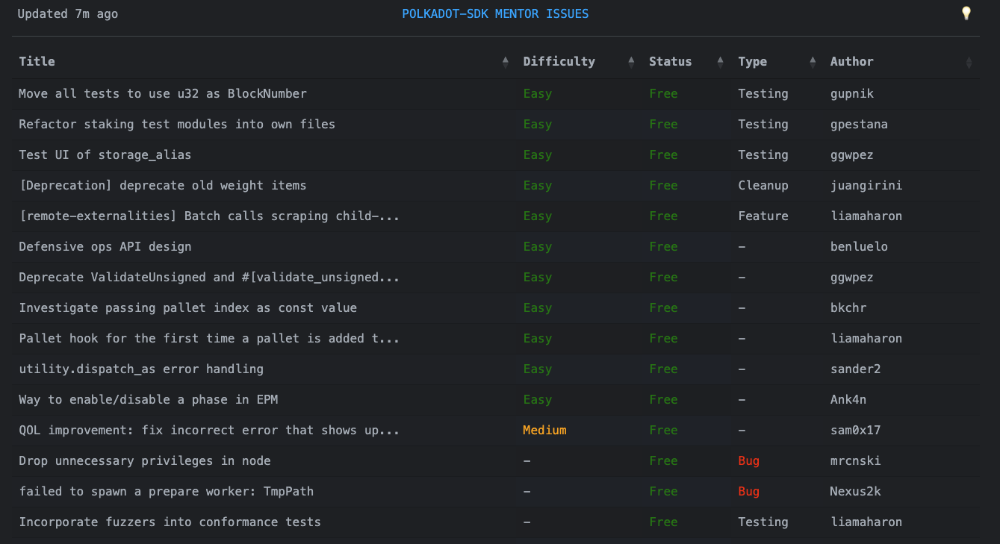

# Polkadot Mentor Issue Board

Lists some good issues for people that want to work on the Polkadot SDK. The list is updated every 6 hours.

# Deployment

It is a single binary without the need for a static asset directory. Build and start with:  
```bash
# If you need an SSL cert:
certbot certonly
cargo install --path .
# Allow non-sudo binaries to listen on low ports:
sudo setcap 'cap_net_bind_service=+ep' $(which polkadot-mentor-issues)
polkadot-mentor-issues --endpoint 0.0.0.0 --port 443 --cert mycert.pem --key mykey.pem
```

# Columns

Explanation for each row that you can see on [mentor.tasty.limo](https://mentor.tasty.limo):



## Title

The title as given by the author of the issue.

## Difficulty

An estimated difficulty as given by the author.

## Status

Whether this issues is `Free`, `Taken` or `WIP` (= work in progress).

## Type

A best-effort classification of the type of this issue.

## Author

Who initially created this issue.

# License 

The SPDX license identifier is GPL-3.0-only. See [LICENSE](LICENSE).
